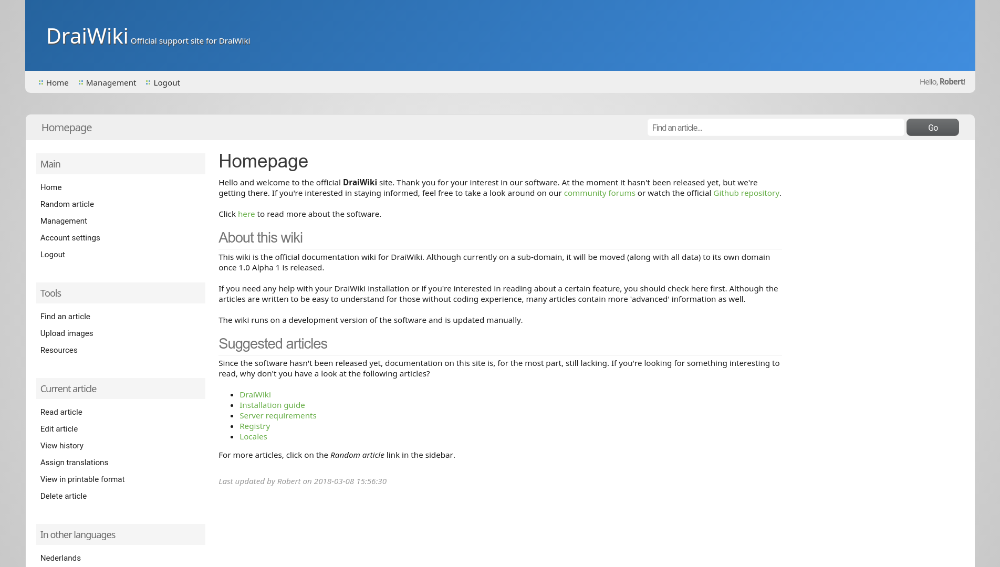

# DraiWiki

**Note:** For a more up-to-date version of the documentation, have a look at our official [wiki](https://draiwiki.robertmonden.com/wiki/index.php). The installation guide can be found [here](https://draiwiki.robertmonden.com/wiki/index.php/article/Installation_guide).

## 1. Introduction to DraiWiki
### 1.1. What is DraiWiki?
DraiWiki is an upcoming open source wiki software that is designed to be customizable, neat-looking, secure and easy to use.

### 1.2. Why use DraiWiki?
There are other free wiki softwares out there, so you might be wondering, what makes DraiWiki the best choice for your website? Well, there are several reasons.

First of all, the software is designed to be customizable. For example, a theme consists of three parts: images, CSS and templates. Basically, what you'll be able to do is this: you can use the image set from the default theme, while using the CSS of a 3rd party theme, while using the templates of yet another 3rd party theme. And the best thing is: it'll only take a few seconds to set up.

It also has built-in multi-language support, meaning you won't need an extension.

## 2. Installation
### 2.1. Server requirements
#### 2.1.1. Minimum
* PHP 7.1+ with the PDO, SimpleXML and Fileinfo extensions enabled
* MariaDB / MySQL (tested on MariaDB 10.1.25)
* Composer (for the installation process)
* NPM (for the installation process)

#### 2.1.2. Optional, but recommended
* GD extension

### 2.2. How to install
#### 2.2.1. Manual installation
1. Install Composer and NPM. If you're on a shared hosting and can't use the terminal, look at section 2.4
2. cd to your http directory
3. Run the following command in your command prompt or terminal: git clone https://github.com/Chistaen/DraiWiki.git
4. Use Composer to install the required packages (composer install)
5. Use NPM to install the required JS libraries (npm install)
6. Edit the configuration file in public/config. Make sure you also edit the BASE_DIRNAME setting
7. Run the DDL (table creation) and DML (data insertion) .sql files: ddl.sql and data.sql.
8. Enjoy!

#### 2.2.2. Command line installation
You can also install DraiWiki from the command line by executing ``./tools/install.py``. This script requires Python 3 to be installed. Just execute the aforementioned file and follow the process. Additional packages that are needed:
* pymysql

### 2.3. Root account
A root account is automatically created upon installation. At the time of writing it is not possible yet to disable the account entirely, but you should still avoid using the root account unless absolutely necessary. Benefits of the root account are:
* Access to debug info
* Unrestricted access to all sections (login/registration pages excluded, obviously)

**Username:** root **Password:** password

We recommend you change the password immediately after installation.

### 2.4. Troubleshooting
#### 2.4.1. Help! I don't have access to a terminal!
If you're on a shared hosting that doesn't allow you to install Composer/NPM, don't worry. There's another solution. Just download the files to your computer and install the Composer and NPM packages from your computer's terminal. Then re-upload the files to your hosting. Happy writing!

## 3. Get involved
If you're interested in helping out with DraiWiki's development, feel free to submit pull requests! Have a look at the issue tracker and self-assign any issues you find interesting.

## 4. Known issues
* Account activation is broken (registration with email activation disabled works fine)

## 5. Open positions
We're always looking to expand our team. Currently, the following positions are open:
* Development
* Quality Assurance

Go to our forum to apply: https://draiwiki.robertmonden.com/forum